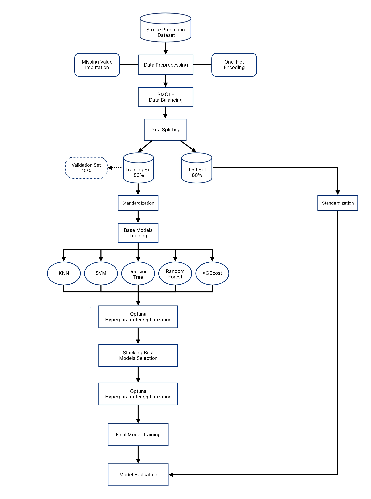
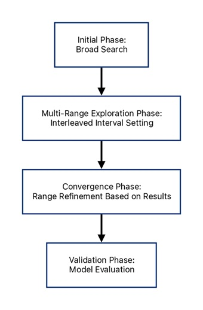

# Stroke Risk Prediction

A machine learning project for stroke risk prediction using data preprocessing, machine learning models, ensemble learning, and hyperparameter optimization.

## Project Overview

This project develops a machine learning-based framework for stroke risk prediction using demographic, medical, and lifestyle-related features.

The project covers data preprocessing, exploratory data analysis, model training, stacking ensemble learning, and hyperparameter optimization.

## Dataset

The project uses the Stroke Prediction Dataset from Kaggle, containing 5,110 records with demographic, medical, and lifestyle-related features.

The prediction task is formulated as a binary classification problem to identify whether a patient has experienced a stroke.

## Project Workflow



## Models

The following machine learning models were evaluated:

- K-Nearest Neighbors
- Support Vector Machine
- Decision Tree
- Random Forest
- XGBoost
- Stacking Ensemble

## Hyperparameter Optimization

Optuna was used for hyperparameter optimization. A staged search strategy was applied to progressively refine the search space and identify suitable hyperparameter combinations.

<p align="center">
  
</p>

## Results

The optimized stacking ensemble achieved strong predictive performance, with an accuracy of 98.10%, recall of 97.12%, MCC of 96.21%, and AUC of 0.9979.

Detailed evaluation results are available in the `results/` directory.

## Repository Structure

```text
stroke-risk-prediction/
│
├── README.md
├── .gitignore
├── figures/
│   ├── README.md
│   ├── project_workflow.png
│   └── hyperparameter_search_strategy.png
├── results/
│   ├── README.md
│   └── model_performance.csv
└── docs/
    └── README.md

```markdown
- `figures/` contains selected workflow and evaluation visualizations.
- `results/` contains summarized model evaluation results.
- `docs/` contains supplementary project documentation.

## Tech Stack

- Python
- Pandas
- NumPy
- Scikit-learn
- SMOTE
- XGBoost
- Optuna
- Matplotlib
- Seaborn

## Code Availability

The source code is currently not publicly available due to ongoing academic publication considerations.
