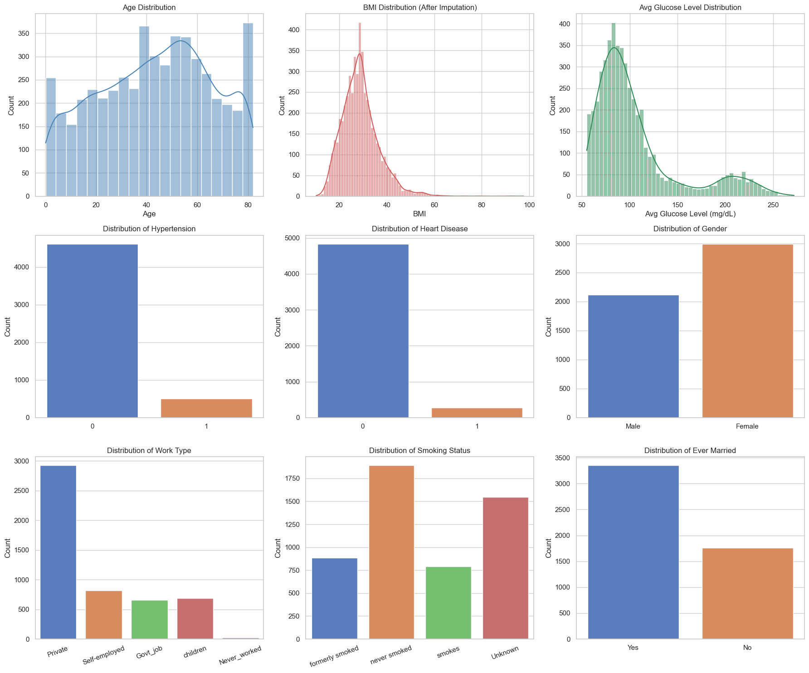
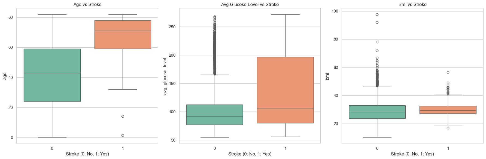
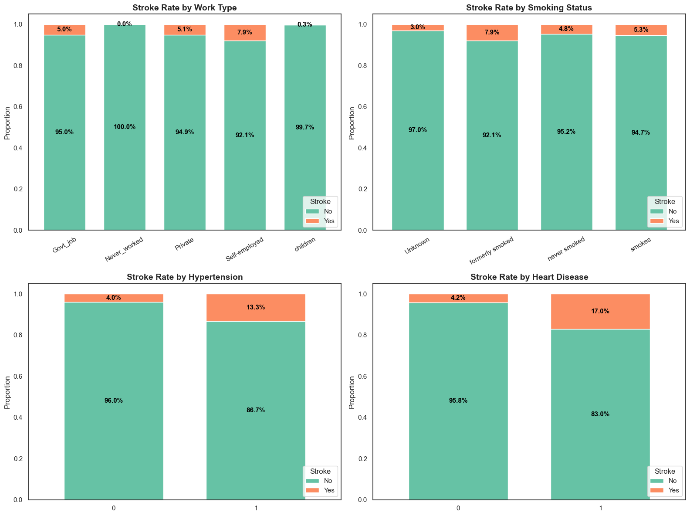
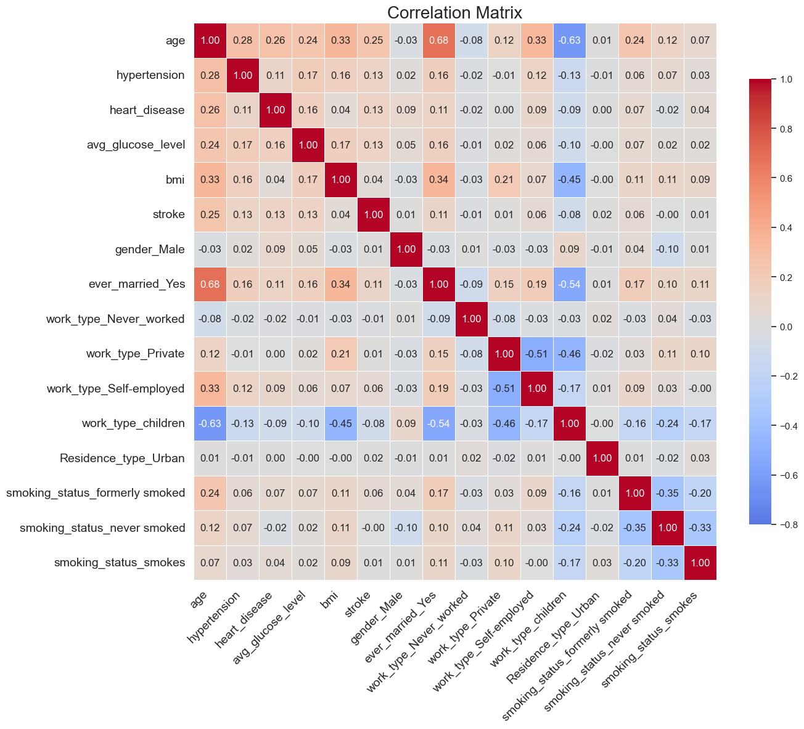

# Exploratory Data Analysis

Exploratory Data Analysis (EDA) was conducted on 5,109 cleaned records to examine feature distributions and identify relationships between patient characteristics and stroke occurrence.

The analysis focused on four main areas:

1. Feature distribution
2. Continuous features and stroke
3. Categorical features and stroke
4. Feature correlation

---

## 1. Feature Distribution

The overall distributions of demographic, clinical, and lifestyle-related features were examined to understand the structure of the dataset.

### 1.1 Continuous Features

The main continuous features included:

- Age
- BMI
- Average glucose level

Age ranged from 0 to 82 years, with a slight concentration among middle-aged and older individuals.

BMI showed an approximately normal but slightly right-skewed distribution, with most observations concentrated between 25 and 30 kg/m².

Average glucose level showed a bimodal distribution, with most observations concentrated within a lower glucose range and another group appearing above 200 mg/dL.

### 1.2 Categorical Features

The categorical feature distributions showed several notable patterns:

- Female samples slightly outnumbered male samples.
- Private-sector employees represented the largest work-type group.
- Hypertension and heart disease were relatively uncommon within the dataset.
- Smoking status contained an `Unknown` category, indicating incomplete smoking information for some individuals.

  

---

## 2. Continuous Features and Stroke

The relationships between stroke occurrence and age, average glucose level, and BMI were examined using group-based comparisons.

### 2.1 Age and Stroke

Age showed a clear difference between stroke and non-stroke groups.

The median age of individuals without stroke was approximately 40 years, while the median age of stroke cases was close to 70 years. Stroke cases were concentrated primarily among older individuals.

This pattern indicates that age was one of the most distinguishable continuous features associated with stroke occurrence.

### 2.2 Average Glucose Level and Stroke

Average glucose level also differed between the two groups.

Most non-stroke cases were concentrated around approximately 70–120 mg/dL, although several high-glucose observations were present.

Stroke cases showed a higher median glucose level and a wider overall distribution, suggesting that elevated glucose levels may be associated with stroke occurrence.

### 2.3 BMI and Stroke

BMI showed less separation between stroke and non-stroke groups.

The medians and interquartile ranges of both groups were similar and substantially overlapped. Compared with age and average glucose level, BMI demonstrated a weaker relationship with stroke when examined independently.

  

---

## 3. Categorical Features and Stroke

Stroke proportions were examined across several categorical features:

- Work type
- Smoking status
- Hypertension
- Heart disease

### 3.1 Work Type

Stroke occurrence varied across different work types.

Self-employed individuals showed the highest stroke proportion at approximately 7.9%, followed by:

- Private-sector workers: 5.1%
- Government workers: 5.0%

Stroke occurrence among children and individuals who had never worked was close to zero, which may partly reflect differences in age distribution.

### 3.2 Smoking Status

Stroke rates also varied across smoking-status categories.

- Formerly smoked: 7.9%
- Smokes: 5.3%
- Never smoked: 4.8%

Former smokers showed the highest observed stroke proportion among the smoking-status groups.

### 3.3 Hypertension

Hypertension showed a clearer difference between groups.

Individuals with hypertension had a stroke rate of approximately 13.3%, compared with approximately 4.0% among individuals without hypertension.

### 3.4 Heart Disease

Heart disease showed an even greater difference.

Individuals with heart disease had a stroke rate of approximately 17.0%, compared with approximately 4.2% among those without heart disease.

Among the examined categorical features, hypertension and heart disease showed particularly clear differences in stroke occurrence.

  

---

## 4. Correlation Analysis

A Pearson correlation matrix was used to examine linear relationships among the features and the target variable.

Among the examined features, age showed the highest positive correlation with stroke:

- Age: `r = 0.25`
- Hypertension: `r ≈ 0.13`
- Heart disease: `r ≈ 0.13`
- Average glucose level: `r ≈ 0.13`
- BMI: `r = 0.04`
- Residence type: `r = 0.02`

Age therefore showed the strongest linear relationship with stroke among the analyzed features, while BMI and residence type showed relatively weak correlations.

  

---

## 5. Key Findings

The EDA highlighted several patterns relevant to subsequent model development:

- Stroke cases were concentrated among older individuals.
- Average glucose levels tended to be higher among stroke cases.
- BMI showed relatively limited separation between stroke and non-stroke groups.
- Hypertension and heart disease were associated with noticeably higher stroke proportions.
- Former smokers showed a higher stroke proportion than current and never smokers.
- Age showed the highest correlation with stroke among the examined features.

These findings provided a basis for understanding the dataset and interpreting subsequent machine learning results.
