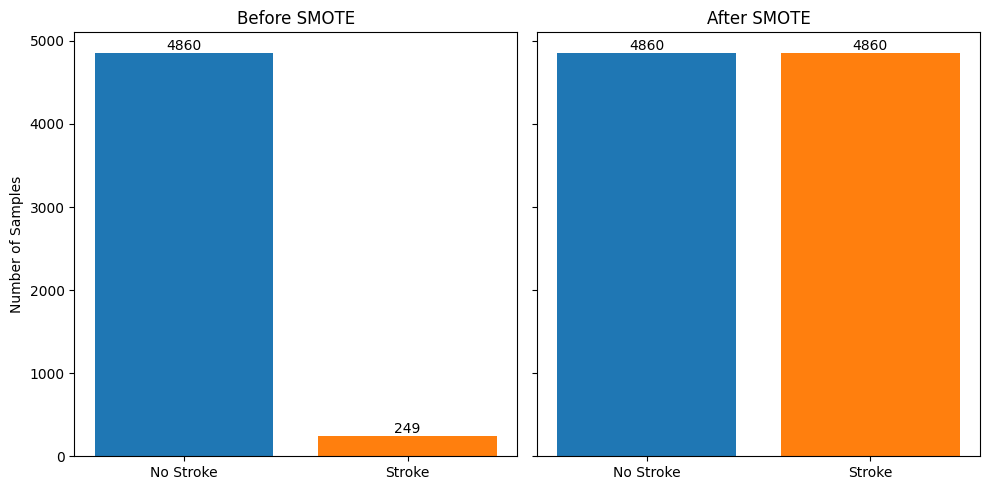
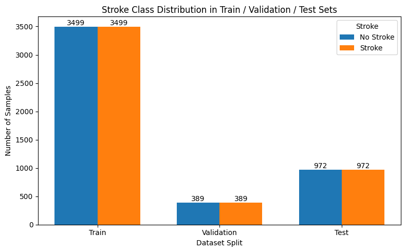

# Methodology

## 1. Dataset

This project uses the Stroke Prediction Dataset obtained from Kaggle.

The dataset originally contains 5,110 records and includes demographic, medical, and lifestyle features used to predict whether an individual has experienced a stroke.

The prediction task is formulated as a binary classification problem.

Main features include:

- Id
- Gender
- Age
- Hypertension
- Heart disease
- Marital status
- Work type
- Residence type
- Average glucose level
- BMI
- Smoking status
- Stroke

The target variable "Stroke" indicates whether a stroke occurred.

---

## 2. Data Preprocessing

Several preprocessing steps were applied before model development.

### 2.1 Data Cleaning

The dataset contains one record labeled as `Other` in the gender feature.

Because this category contains only a single observation and is not sufficiently representative for modeling, the record was removed before further analysis.

### 2.2 Missing BMI Replacement

Missing values were observed in the BMI feature.

Instead of using a single overall mean value, missing BMI values were replaced using group-based mean values based on gender and work type.

This approach was used to preserve more contextual information within the dataset.

### 2.3 Categorical Feature Encoding

Categorical variables were transformed using one-hot encoding.

The encoding process converted categorical features into numerical representations suitable for machine learning algorithms.

### 2.4 Feature Standardization

Numerical features were standardized using z-score normalization.

Standardization was applied to reduce scale differences among numerical variables and improve the stability of distance-based and margin-based models.

### 2.5 Class Imbalance Handling

The original dataset presents a substantial class imbalance between stroke and non-stroke cases, with stroke cases accounting for approximately 5% of the total samples.

To address this issue, the Synthetic Minority Over-sampling Technique (SMOTE) was applied to generate synthetic samples for the minority class, resulting in a balanced class distribution of 1:1.

The class distribution before and after SMOTE is shown in the figure below.

  

---

## 3. Exploratory Data Analysis

Exploratory Data Analysis (EDA) was conducted on the cleaned dataset to examine feature distributions and identify potential relationships between patient characteristics and stroke occurrence.

The analysis consisted of four main components:

- Feature Distribution
- Continuous Features and Stroke
- Categorical Features and Stroke
- Correlation Analysis

EDA was also used to support feature understanding and subsequent modeling decisions.

---

## 4. Data Splitting

The dataset was divided using stratified sampling to preserve the class distribution.

An initial split divided the dataset into:

- 80% training and validation data
- 20% testing data

The training and validation portion was then further divided, with 10% of this subset assigned to the validation set.

This resulted in an approximate final data split of:

- 72% training data
- 8% validation data
- 20% testing data

The resulting class distribution across the training, validation, and testing sets is shown below.

  

The balanced distribution across the three subsets reflects the class balancing procedure applied prior to model development.

---

## 5. Machine Learning Models

Five individual machine learning algorithms were initially evaluated.

### 5.1 K-Nearest Neighbors

K-Nearest Neighbors was included as a distance-based classification model.

Its performance is sensitive to feature scale and the number of neighboring samples used for prediction.

### 5.2 Support Vector Machine

Support Vector Machine was evaluated to capture potentially complex nonlinear decision boundaries.

Different kernel and regularization settings were considered during hyperparameter optimization.

### 5.3 Decision Tree

Decision Tree was used as an interpretable tree-based classification model.

Its hyperparameters were optimized to control tree complexity and reduce overfitting.

### 5.4 Random Forest

Random Forest was used as an ensemble-based tree model.

It combines multiple decision trees to improve predictive stability and reduce variance.

### 5.5 XGBoost

XGBoost was included as a gradient boosting model capable of modeling nonlinear relationships and feature interactions.

Its learning rate, tree depth, sampling parameters, and regularization-related settings were optimized during model development.

---

## 6. Hyperparameter Optimization

Optuna was used to optimize model hyperparameters through a stage-wise narrowing approach, in which the search space was progressively refined across four phases.

1. **Initial Phase:** A broad hyperparameter range was explored to identify potentially promising regions.
2. **Multi-Range Exploration Phase:** Multiple overlapping search intervals were evaluated to increase search diversity and reduce the risk of premature convergence.
3. **Convergence Phase:** The search space was narrowed based on high-performing parameter regions identified in previous trials.
4. **Validation Phase:** The selected hyperparameter combination was applied to the final model and evaluated using the fixed test set.

This strategy was designed to balance broad exploration with efficient refinement of the hyperparameter search space.

---

## 7. Stacking Ensemble

A stacking ensemble was developed to integrate the complementary strengths of multiple machine learning models.

Following hyperparameter optimization of the individual models, the three best-performing models were selected as the base learners based on their optimized performance.

### Base Learners

- K-Nearest Neighbors
- Random Forest
- XGBoost

### Meta Learner

- Random Forest

The predictions generated by the base learners were combined and provided as input to the meta learner for final classification.

This architecture was designed to improve generalization by integrating models with different learning characteristics.

The hyperparameters of the stacking ensemble were jointly optimized using Optuna.

---

## 8. Model Evaluation

Model performance was evaluated using the following classification metrics:

- Accuracy
- Precision
- Recall
- F1-score
- Specificity
- Matthews Correlation Coefficient (MCC)
- ROC AUC

---

This repository provides selected methodology descriptions, figures, and summarized results for portfolio and research presentation purposes.
