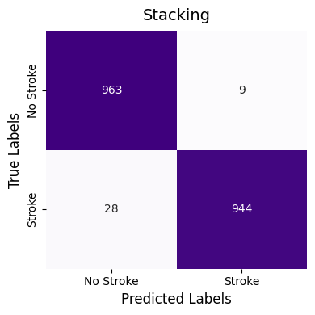

# Results

This folder contains selected evaluation results from the stroke risk prediction project.

## 1. Baseline Model Performance

Five individual machine learning models were first evaluated using their baseline configurations:

- K-Nearest Neighbors
- Support Vector Machine
- Decision Tree
- Random Forest
- XGBoost

Among the baseline models, Random Forest achieved the strongest overall performance, particularly in accuracy, precision, specificity, and MCC.

Detailed baseline results are available in [`baseline_model_performance.csv`](baseline_model_performance.csv).

## 2. Optimized Models and Final Stacking

The five individual models were optimized using Optuna.

Based on the optimized performance, the three best-performing models were selected as base learners for the stacking ensemble:

- K-Nearest Neighbors
- Random Forest
- XGBoost

Random Forest was used as the meta learner.

Among the optimized individual models, Random Forest achieved the strongest overall performance, while K-Nearest Neighbors obtained the highest recall of 97.34%. 

The final stacking ensemble further improved overall performance, achieving the highest accuracy, MCC, and AUC among the evaluated models.

Detailed optimized model and final stacking results are available in [`optimized_and_stacking_performance.csv`](optimized_and_stacking_performance.csv).

The final stacking model achieved:

- Accuracy: 98.10%
- Recall: 97.12%
- MCC: 96.21%
- AUC: 0.9979

The confusion matrix shows that the final stacking model correctly classified most stroke and non-stroke cases, with relatively few false positives and false negatives.

  

## Evaluation Metrics

All models were evaluated using:

- Accuracy
- Precision
- Recall
- F1-score
- Specificity
- Matthews Correlation Coefficient (MCC)
- AUC
